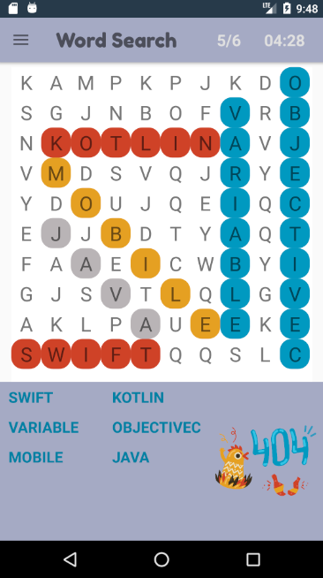
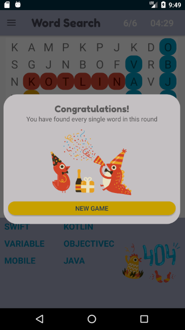

# Word Search Game Application for Android
by **Andressa Machado**

## Description
`Word Search Game is a randomized 10 x 10 grid where the words are placed for the user to find by swiping over them.` implemented for Shopify internship application.

The application shows the words to be found by the user in the grid at the bottom of the screen, keeps track of the number of words found,
keeps track of the time passed and allows the user to start a new game when every word is found.

- [x] Animated Splash Screen

- [x] Application is adapted to landscape mode

- [x] Words are randomly placed in the grid

- [x] User can find the words by swiping over the words

## Android version 
Application was developed using `Android SDK 6.0 API 23 Marshmallow`.

## Running the Application
An APK was generated and added to this repository, you can find it following this path [Word-Search-Game/app/release/app-release.apk](https://github.com/andressamachado/Song-Lyrics-Search-Application/blob/master/app/release/app-release.apk), but please, be aware that this application was developed under API 23 and some functions could not run properly in some devices with lower API.

You can always clone the project, and using Android Studio, run the application using an Android Virtual Device (AVD) with API 23.

## Illustrations
Every Illustration used in this project are from the Artist **_Dmitry Nikulnikov_** .
Those illustrations are the free low-quality trial and this application is only for practice and academic purpose. The application won`t be published.

The **_Dmitry Nikulnikov`s_** Arabica collection can be found [here](https://icons8.com/illustrations/style--arabica).

## Screenshots - app running in a portrait mode 

    

## Screenshots - app running in a landscape mode

  

## Contact 
I can be reached at pess0005@algonquinlive.com, andressa.pamachado@gmail.com or via my [LinkedIn](https://www.linkedin.com/in/andressa-machado-59705792/) page.

Any feedback is always welcome as I am building my skills and they are more than valuable. 

Thank you for having taken the time to see my android application :smiling_face_with_three_hearts:
